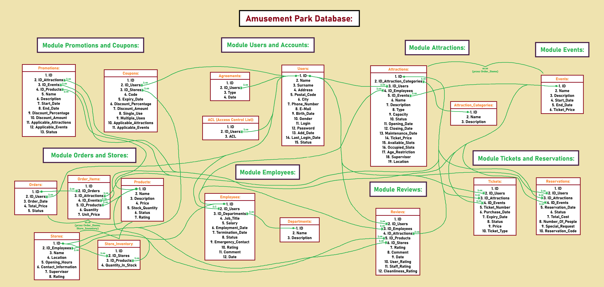

# 🎢 Amusement Park Management System  

This repository contains a **system** designed to manage and optimize the operations of an amusement park. The project integrates a **robust database system** and a **dynamic web application** built using **ASP.NET Razor Pages**, ensuring scalability, advanced functionality, and user-friendly interfaces.  

---

## 🚀 Features  

### Database System  
- **8 modules**, **18 tables** for structured and detailed data management.  
- Includes SQL scripts for database schema, triggers, views, and stored procedures:  
  - `AmusementParkDB.sql`  
  - `Procedures.sql`  
  - `Triggers.sql`  
  - `Views.sql`  
- Covers key functionalities:  
  - **User Management** (accounts, agreements, and access control).  
  - **Attractions and Events** (detailed categorization and planning).  
  - **Tickets and Reservations** (sales and customer experience optimization).  
  - **Promotions and Coupons** (discounts and marketing strategies).  

### Web Application  
- Built using **ASP.NET Razor Pages** with a modular and maintainable structure.  
- **CRUD Operations**: Add, update, and delete records for every database table.  
- **Table Display**:  
  - Displays full data from at least two tables (`Users`, `Orders`) on separate pages.  
- **Custom Buttons**:  
  - Delete all records from a selected table with a single click.  
  - Anonymize column data (e.g., replacing names in the `Users` table with generic values like `User-1`).  
- **Filtering and Sorting**:  
  - Implemented for the `Users` table.  
  - Filter by `Surname`, sort by `ID`, `Name`, or `Surname`.  
- **Master-Slave Relationship**:  
  - Selecting an order in the `Orders` table dynamically loads its associated items in the `OrderItems` table.  

---

## 📊 ERD Diagram  

A detailed **Entity-Relationship Diagram (ERD)** is included to visualize the database structure and relationships between tables.  
  

---

## 📂 File Structure  

### Database Files  
- **Database Schema**:  
  - `AmusementParkDB.sql`  
- **Triggers**:  
  - `Triggers.sql`  
- **Views**:  
  - `Views.sql`  
- **Stored Procedures**:  
  - `Procedures.sql`  

### Web Application Files  
- **Solution File**: `AmusementParkDB.sln`  
- **Configuration**:  
  - `appsettings.json`: Contains connection strings and app configuration.  
  - `appsettings.Development.json`: Development-specific settings.  
- **Startup Files**:  
  - `Program.cs`: Application entry point.  
- **Pages**:  
  - `Create.cshtml` & `Create.cshtml.cs`: Add records.  
  - `Edit.cshtml` & `Edit.cshtml.cs`: Modify records.  
  - `Delete.cshtml` & `Delete.cshtml.cs`: Remove records.  
  - `Index.cshtml` & `Index.cshtml.cs`: List records with sorting/filtering.  
  - `Details.cshtml` & `Details.cshtml.cs`: View record details.  
- **Data Context**:  
  - `AmusementParkDbContext.cs`: Configures the database and its relationships using Entity Framework Core.  

---

## 📝 Modules Overview  

### 1. Users and Accounts  
Manages user data, agreements, and access control lists.  
### 2. Attractions  
Detailed information about park attractions, including categories, availability, and maintenance schedules.  
### 3. Tickets and Reservations  
Tracks ticket purchases, reservation details, and customer preferences.  
### 4. Employees  
Centralized data for managing employee roles, departments, and performance.  
### 5. Promotions and Coupons  
Automates promotional campaigns and coupon management for park attractions.  
### 6. Reviews  
Captures user feedback for attractions, employees, and products.  
### 7. Orders and Stores  
Manages product inventories, orders, and store operations.  
### 8. Events  
Schedules and monitors events for enhanced customer engagement.  

---

## 📜 Example Data  

The database includes example data for testing functionality, such as users, tickets, attractions, and more.  

---

## 🎯 How to Use  

1. Clone the repository.  
2. Run the `AmusementParkDB.sql` file to create the database schema.  
3. Configure the connection string in `appsettings.json`.  
4. Build and run the Razor Pages application using Visual Studio or the .NET CLI.  
5. Use `Procedures.sql`, `Triggers.sql`, and `Views.sql` to add advanced functionality.  
